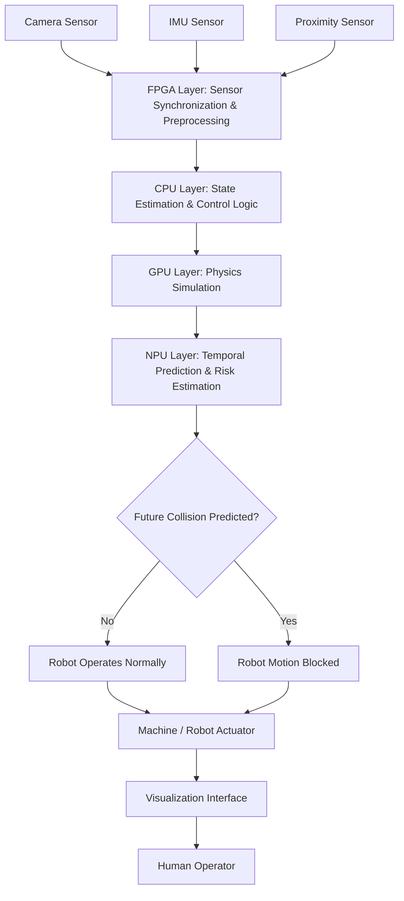

# PRECOG Edge

### Predictive Physical Intelligence Engine

**AMD Open Innovation Hackathon Project — Temporal Systems Lab**

---

## What is PRECOG Edge?

PRECOG Edge is a real-time predictive cognition system that enables machines to anticipate dangerous events before they occur.

Current autonomous systems react **after** a situation becomes unsafe.
PRECOG Edge predicts unsafe outcomes **before** they happen and prevents them.

Instead of:

> detect → react

We demonstrate:

> observe → predict → prevent

The system models motion dynamics, forecasts future trajectories, evaluates risk, and autonomously blocks unsafe machine actions within a real-time control loop.

---

## The Problem

Robots, drones, and autonomous machines today rely on perception-based AI.
They detect objects but do not understand physical consequences.

This creates a critical limitation:

* robots require safety cages
* collaborative automation is restricted
* accidents still occur
* autonomy cannot be fully trusted

The root issue is not perception accuracy.

It is the inability to compute **future physical state** within the control loop deadline (~20–30 ms).

Machines can see the world.
They cannot foresee it.

---

## Our Insight

Safe autonomy requires a missing layer:

**Predictive Physical Intelligence**

A machine must choose actions based on *what the world will become*, not what the world currently is.

PRECOG Edge introduces a foresight layer that predicts near-future motion and prevents unsafe actions before collision occurs.

---

## Key Features

* Real-time motion tracking
* Kalman filter state estimation
* Future trajectory prediction
* Predictive collision detection
* Autonomous safety control
* Live explainable visualization

---

## How It Works

1. Camera detects moving object
2. System estimates velocity and direction
3. Future positions are predicted
4. Predicted trajectory checked against protected workspace
5. Robot actuator automatically stops if danger is predicted

The robot stops **before** impact occurs.

---

## Demo Behavior

When an object moves toward the protected zone:

• Warning appears early
• Robot motion freezes
• Collision is prevented

The system does not react to a collision.

It prevents a collision.

---

## Architecture



---

## Mapping to AMD Heterogeneous Computing

| PRECOG Module      | AMD Equivalent             |
| ------------------ | -------------------------- |
| Sensor ingestion   | Xilinx FPGA / Adaptive SoC |
| State estimation   | AMD EPYC / Ryzen CPU       |
| Trajectory rollout | AMD Instinct GPU (ROCm)    |
| Prediction         | Ryzen AI NPU               |
| Safety controller  | Embedded control logic     |

PRECOG Edge demonstrates how heterogeneous computing enables real-time predictive autonomy at the edge.

---

## Installation

Clone the repository:

```bash
git clone https://github.com/<your-username>/precog-edge
cd precog-edge
```

Create environment:

### Windows

```bash
python -m venv venv
venv\Scripts\activate
```

### Linux / macOS

```bash
python3 -m venv venv
source venv/bin/activate
```

Install dependencies:

```bash
pip install -r requirements.txt
```

Run the system:

```bash
python main.py
```

Press **ESC** to exit.

---

## Testing the System

1. Start the program
2. Keep workspace empty → robot moves
3. Roll a ball toward the circle

Expected:
Robot stops **before the object enters the zone**

See `TEST_GUIDE.md` for full testing procedures.

---

## Visual Legend

| Overlay     | Meaning              |
| ----------- | -------------------- |
| Green box   | detected object      |
| Red dot     | estimated position   |
| Blue arrow  | velocity             |
| Yellow dots | predicted trajectory |
| Cyan circle | protected workspace  |
| Blue bar    | robot arm            |
| Red warning | predicted collision  |

---

## Why This Matters

PRECOG Edge shifts autonomy from reactive safety to predictive safety.

Instead of machines responding to dangerous events, they anticipate them.

This capability enables:

* safe human-robot collaboration
* trustworthy automation
* reliable autonomous operation

We are not improving perception.

We are giving machines foresight.

---

## Future Work

* ROS2 robot integration
* ROCm GPU simulation rollout
* Multi-object tracking
* Deployment on AMD adaptive SoC hardware

---

## Team

**Temporal Systems Lab**

AMD Open Innovation Hackathon 2026

---

## License

Research prototype for demonstration and educational purposes.
